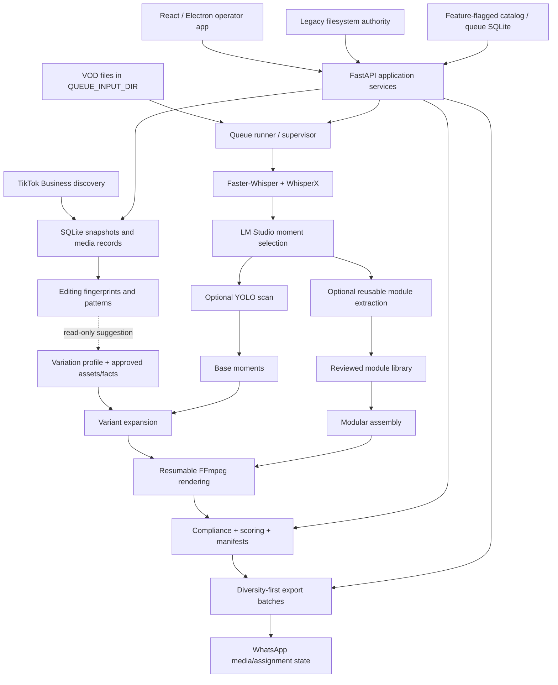

# Project Context

**Last reviewed:** 2026-08-10  
**Workspace:** `C:\Data\Clipper Ai Trends`  
**Git branch/HEAD:** `main` at `d1035f1` (`Medium Efforts Changes`, 2026-07-13)  
**Review basis:** current working tree, including uncommitted files; source, configuration, launchers, tests, API/UI, and local catalog status.

> The worktree is intentionally dirty and contains substantial user work beyond `HEAD`. Always inspect `git status --short --branch` before editing, preserve unrelated changes, and treat the current filesystem—not the last commit—as the implementation under review. Generated/operational paths such as `working/`, `runs/`, `pipeline.log*`, frontend build output, and `node_modules/` are not source documentation.

## Executive Summary

Clipper is a Windows-first, local PROYA video-production system. Its core turns long Indonesian skincare livestream VODs into short vertical variants through transcription, local-LLM moment selection, optional YOLO product detection, evidence-aware creative treatments, resumable FFmpeg rendering, compliance checks, scoring, and export packaging.

The same repository also contains:

- a resumable multi-VOD queue, continuous supervisor, and graceful control CLI;
- reusable product-specific hook/main/CTA extraction, review, validation, and modular assembly;
- revisioned variation profiles, presets, product-information extraction, dynamic text, B-roll, and preview rendering;
- a typed FastAPI application layer, React operator UI, and portable Electron shell;
- a staged SQLite catalog and optional SQLite queue authority while legacy files remain the defaults;
- TikTok Business OAuth, ranked trend discovery, rights-confirmed media download/linking, editing fingerprints, and read-only profile suggestions;
- WhatsApp-compatible media conversion plus authoritative batch/affiliate/send state and a Google Sheets outbox;
- a standalone fixed 15-second PROYA text-overlay utility.

There is no implemented social-platform publishing step. TikTok integration is research/authorization, not posting. Export/WhatsApp handoff is the final automated delivery boundary. No separate Instagram carousel, Seedance prompt, price-list, or general social-content system exists in this repository.

## Verified State on 2026-08-10

- `python -m pytest -q`: **500 passed**, **27 subtests passed**, one Starlette/TestClient deprecation warning.
- `pnpm.cmd test`: **18 files / 82 tests passed**.
- `pnpm.cmd build`: production TypeScript/Vite build passed.
- `pnpm.cmd desktop:test`: **11 passed**.
- Runtime used for this verification: Python 3.11.9, Node 26.5.0, pnpm 11.13.1, and a 2026-04-16 FFmpeg/FFprobe build. These are observed workstation versions, not declared minimums.
- `python -m clipper_app.catalog_cli status`: catalog schema **12**, SQLite integrity `ok`, no recorded repair rows, default catalog mode `legacy`, and default queue mode `json`.
- The current catalog contains successful trend fingerprints and patterns. Older documentation saying trend analysis had never completed is obsolete.

## System Map



Important boundaries:

- Top-level Python modules still own pipeline algorithms. `clipper_app` wraps them with typed settings, commands, results, reads, jobs, events, storage, and security.
- JSON/manifests/sidecars/module indexes/logs remain authoritative in default modes. The catalog is rebuildable; SQLite queue authority is opt-in.
- React and Electron never process video themselves. They read FastAPI data or submit controlled backend work.
- Variation changes affect future renders only. Trend recommendations are not auto-applied.
- WhatsApp media preparation can run while direct affiliate claims remain disabled.

## Project Inventory

| Area | Current implementation | Primary entry points |
| --- | --- | --- |
| Single-VOD pipeline | Operational transcription, moment selection, vision, variants, render, compliance, score, modules, and export hooks | `main.py`, `python main.py --video ...` |
| Queue and supervisor | Resumable four-stage scheduling, retries, stable-file discovery, run/pipeline/variant modes, graceful control | `video_queue.py`, `queue_supervisor.py`, `queue_control.py`, `run_queue*.ps1` |
| Reusable modules | Extraction, sidecars/index, readiness, manual review, visual validation, same-date assembly | `module_*.py`, `run_module_assembly.ps1` |
| Variants and facts | Schema-12 profiles, 1-6 variants, presets, previews, source-supported dynamic text, product B-roll | `variation_profile.py`, `variation_engine.py`, `dynamic_text.py`, `product_information.py`, `product_broll.py` |
| Scoring/compliance/export | Multi-dimension score groups, optional Qwen-VL host focus, fail-closed compliance, diversity-first batches | `clip_scorer.py`, `compliance_checker.py`, `export_packager.py` |
| Application API | Typed reads/mutations, auth, jobs/results/audit, SSE, safe artifacts, static SPA | `clipper_app/web_api.py`, `clipper_app/application/` |
| React operator app | Production, review, trends, variants, modules, delivery, activity, settings/diagnostics | `new_app/src/App.tsx`, `new_app/src/variants/` |
| Electron shell | External-runtime resolution, managed Uvicorn, token injection, guarded window/OAuth, portable build | `new_app/electron/` |
| Catalog/queue storage | Schema-12 catalog, trend/change-event storage, JSON/dual/SQLite queue repository, maintenance CLI | `catalog.py`, `queue_repository.py`, `catalog_cli.py` |
| TikTok trends | OAuth, discovery, download/link, classification diagnostics, fingerprint/pattern aggregation | `tiktok_oauth.py`, `trends.py`, `trend_analyzer.py` |
| WhatsApp delivery | Media policy/conversion, permanent mirror, SQLite assignment/item/event/outbox state | `whatsapp_media.py`, `whatsapp_backlog.py`, `clipper_app/application/whatsapp_delivery.py` |
| Fixed overlay utility | Three hard-coded 15-second Indonesian copy timelines rendered to 720 x 1280 | `scripts/add_proya_cleanser_text.py` |

## Core Pipeline

### Current Workflow

1. Validate input media, FFmpeg/FFprobe, audio, configured local services/models, output paths, and disk space.
2. Transcribe with Faster-Whisper and align words with WhisperX; retain raw checkpoints and configured fallback behavior.
3. Detect candidate moments through LM Studio in chunks; validate duration, speech density, focus, score, and overlap.
4. Optionally run YOLO over moment ranges for product/host events.
5. Optionally extract reusable hook/main/CTA modules before render-list truncation.
6. Load `working/variation_profile.json` or generate the default profile and expand each base moment into up to six deterministic variants.
7. Build evidence-backed dynamic text from approved PDF/DOCX facts, content topics, compliance results, and role/intensity settings.
8. Render missing jobs incrementally with FFmpeg, preserving stage fingerprints, render state, manifests, audio timing, and resume semantics.
9. Run compliance, safe auto-fixes/blocking, score dimensions/flags, optional Qwen-VL vision scoring, and auto-sort.
10. Optionally package export-ready clips into append-only diversity-first batches and register them with WhatsApp state.

### Creative Features

Current render/profile support includes hook types, host or audio-over-B-roll mode, relevant product B-roll, transitional hooks, before/after overlays, subtitles and karaoke highlighting, per-role dynamic text, fonts/colors/motion presets, product/host zoom, mirror, color grade, letterbox/top-bar hooks, SFX, BGM/ducking, silence trimming, emojis, end cards, and multiple output variants.

Product-information sources live under `assets/information/`. `product_information.py` reads searchable PDF text and DOCX paragraphs/tables, optionally classifies source-supported facts through LM Studio, falls back to rules, rejects conflicts/ambiguity, and retains source locators. Scanned image-only PDFs are not OCR processed.

### Important Configuration

Current `config.py` defaults include:

- `OUTPUT_DIR=D:\output_clips`, `WORKING_DIR=working`, `QUEUE_INPUT_DIR=D:\VOD`, `MODULE_LIBRARY_DIR=D:\proya_modules`.
- 25-60 second selected moments, `MIN_SCORE=7.0`, 30 FPS H.264 NVENC output.
- `VARIANTS_PER_CLIP=6`, variation-profile schema 12, product-information LLM enabled, dynamic-text mode `balanced`.
- `SCORER_ENABLED=True`, `SCORER_VISION_ENABLED=True`, compliance enabled/auto-fix/high-risk blocking enabled.
- Module extraction and normal module assembly disabled by default; explicit CLI/workflow paths enable them.
- Export batches enabled with 15 clips, diversity-first rolling strategy, target five distinct VODs, and no more than three per VOD until the configured wait relaxes diversity.
- `WHATSAPP_DELIVERY_ENABLED=True`, but both direct-delivery cutover flags are `False`.
- `TREND_QWEN_ENABLED=False`; deterministic visual/transcript analysis still works.

Do not assume defaults are portable or production-approved. Review the active settings override file and profile revision in addition to `config.py`.

## Queue, Resume, and Control

`VideoQueueRunner` schedules `transcribe`, `llm`, `yolo`, and `ffmpeg` stages with per-stage state, retries, admission limits, and progress projection. `queue_supervisor.py` watches stable `.mp4`, `.mkv`, and `.mov` files and starts repeated passes. `queue_control.py` provides versioned start/continue/pause/stop/status behavior.

Supported launch dimensions:

- Run mode: `single_video`, `folder_once`, `folder_repeat`.
- Pipeline mode: `full`, `clips_only`, `modules_only`, `raw_cuts_only`.
- Variant mode: `all`, `original`, `custom` plus count.

Default state is `working/video_queue_state.json`. `QueueStateRepository` adds `dual` and `sqlite` modes, active schema 3, immutable SQLite history, and monthly checksummed JSONL journals. Schema 2 remains the rollback/export contract.

Never infer a live process solely from a saved `running` row. Use queue control/status, process inspection, and health tooling before clearing or resuming state.

## FastAPI, Jobs, and Security

`clipper_app.web_api` exposes health/catalog/events, overview/dashboard/queue, scores, compliance, modules, logs, settings, product information, variations, trends/TikTok OAuth, control jobs/results, system/artifacts, WhatsApp delivery, and production mutation routes.

All JSON reads use a common envelope. Every mutation and sensitive read requires `Authorization: Bearer <CLIPPER_CONTROL_TOKEN>`. The two TikTok callback paths are the narrow unauthenticated exception. Trusted hosts/origins and filesystem containment remain enforced.

Control jobs use schema-version-2 metadata under `working/app_control_jobs/`, bounded results under `working/app_control_job_results/`, and audit JSONL. The scheduler has bounded interactive/batch lanes, serializes compute-heavy work, and rejects conflict keys/capacity overflow. Stale active jobs become `interrupted` at startup. Settings writes go only to `working/settings_overrides.json` with validation/revisions; the app never writes `config.py`.

Change events live in SQLite and `/api/events` provides durable SSE invalidation with replay/reset/heartbeats. React falls back to polling.

Electron and `run_new_app.ps1` generate/inject per-process control tokens. The compiled browser-only SPA has no token-entry/persistence mechanism, so Cloudflare-hosted browser access is read-limited unless a separately approved server-side auth integration is added.

## React and Electron

The current UI routes are:

- Overview.
- Production Live and Queue.
- Review Clips and Compliance.
- Trends.
- Variants.
- Modules.
- Deliveries.
- Activity Jobs and Logs.
- Settings Configuration and Diagnostics.

The Variants workspace is componentized under `new_app/src/variants/` with a command bar, navigator, seven editor tabs, preview/readiness panel, presets, and diagnostics. `App.tsx` still owns the surrounding pages and much cross-page behavior.

Electron 0.4.1 packages `Clipper-0.4.1-portable.exe`, resolves an external project/Python runtime, starts Uvicorn on a free loopback port, injects a fresh token only for that origin, guards navigation, opens only the approved TikTok OAuth URL externally, and stops only its child backend. It does not bundle the production runtime.

## TikTok Trend Research

`TikTokOAuthService` owns encrypted credentials/state and advertiser selection. `TrendService` calls TikTok API for Business discovery, stores snapshots/diagnostics, requires explicit content-rights confirmation before `yt-dlp`, validates and links local media, then calls `trend_analyzer.py` for editing fingerprints.

Analysis combines FFprobe/OpenCV cuts/pace/layout evidence, transcript metrics, and optional Qwen-VL semantic fields. It caches fingerprints by media hash/analyzer version and aggregates supported recommendations into a suggested variation profile tied to the base profile revision. Suggestions remain read-only.

Current catalog state proves that discovery, downloads/links, fingerprints, and patterns have all completed locally. Live provider access, rights, callback routing, API field stability, and extractor behavior remain external operational risks.

## WhatsApp Media and Delivery

Canonical delivery media lives under `D:\output_clips\export_batches_whatsapp\<number>`. Its separate SQLite database owns batch registration, packaging floor, affiliate claims, optimistic assignment versions, item send IDs/status, audit events, and Google Sheets outbox.

The media subsystem classifies copy/remux/transcode/review, targets WhatsApp-safe H.264/AAC MP4, validates size/fps/color/decode, handles approved color-signature exceptions, and publishes whole staged batch directories atomically.

Direct claims/send transitions require both `WHATSAPP_DIRECT_PC_DELIVERY_ENABLED=True` and `WHATSAPP_LEGACY_DRIVE_WORKFLOW_DISABLED=True`; current defaults are false. Media conversion and registration can continue before cutover. n8n must call the authenticated API and must not open SQLite or mutate numeric batch folders directly.

## Important Files and Paths

| Path | Responsibility |
| --- | --- |
| `main.py` | Compatibility CLI and single-VOD orchestration |
| `config.py` | Machine-specific evaluated defaults; never written by the app |
| `transcriber.py`, `moment_detector.py`, `vision_scanner.py` | Analysis stages |
| `variation_profile.py`, `variation_engine.py`, `dynamic_text.py` | Profile persistence, expansion, and dynamic content |
| `product_information.py`, `product_broll.py`, `content_topics.py` | Evidence/assets/topic matching |
| `ffmpeg_editor.py`, `stage_cache.py` | Composition, FFmpeg execution, resume compatibility |
| `clip_scorer.py`, `compliance_checker.py` | Score and policy gates |
| `module_*.py` | Reusable module extraction/review/readiness/assembly |
| `export_packager.py` | Diversity-first export publication |
| `video_queue.py`, `queue_supervisor.py`, `queue_control.py` | Bulk scheduling and control |
| `clipper_app/` | Typed application/API/security/catalog/job boundary |
| `new_app/src/` | React app and tests |
| `new_app/electron/` | Desktop lifecycle/security/packaging |
| `trend_analyzer.py`, `clipper_app/application/trends.py` | TikTok research |
| `whatsapp_media.py`, `whatsapp_backlog.py` | WhatsApp media policy/conversion |
| `assets/` | Fonts, SFX, emojis, B-roll, transitions, preview media, information sources |
| `dataset/`, `models/proya_best.pt` | YOLO data and trained weights |
| `working/` | Generated caches/state/catalog/jobs/secrets; not source code |
| `D:\output_clips` | Configured finished media/export/delivery root |
| `D:\proya_modules` | Configured reusable module library |

## Common Commands

```powershell
# Setup and app
python -m pip install -r requirements.txt
.\run_new_app.ps1 -PnpmExe pnpm.cmd -InstallFrontendDeps
.\run_new_app.ps1 -PnpmExe pnpm.cmd

# Pipeline and queue
python main.py --test-lm-studio
python main.py --video "D:\VOD\livestream.mp4"
.\run_queue.ps1 -DryRun
.\run_queue_forever.ps1 -RunMode folder_repeat -PipelineMode full -VariantMode all -DryRun
.\run_queue_control.ps1 status -Json

# Modules/export/storage
python main.py --video "D:\VOD\livestream.mp4" --extract-modules-only
.\run_module_assembly.ps1 -DryRun
python main.py --package-export-batches --dry-run
python -m clipper_app.catalog_cli status
python -m clipper_app.catalog_cli verify

# WhatsApp inventory only
python scripts/whatsapp_backlog.py
```

Use dry-run/read-only paths before any command that moves or publishes media.

## Known Constraints and Risks

- The project is tied to Windows/D-drive paths, CUDA/NVENC, local models, and separately installed FFmpeg/LM Studio.
- Python/CUDA/PyTorch/FFmpeg/LM Studio/model versions are not pinned as a complete reproducible production environment.
- Large generated state/media/logs make broad scans and backups expensive.
- Historical source comments contain mojibake/encoding damage; do not copy corrupted characters into new UI/docs.
- The worktree contains extensive uncommitted source and documentation; do not reset or overwrite unrelated changes.
- Catalog/queue feature flags create multiple compatibility paths that must remain tested until cutover is formally complete.
- `App.tsx` remains large despite Variants componentization.
- Portable packaging has runtime unit coverage but still needs a real packaged startup/navigation/control smoke on the target workstation.
- TikTok API fields/access and `yt-dlp` behavior can change externally; downloaded content requires approved rights/retention policy.
- WhatsApp direct delivery is not enabled and must not overlap a legacy Drive assignment/send workflow.
- Root `.gitignore` does not comprehensively exclude every possible `.env`/credential/key file. Do not create or commit secrets.
- LM Studio API-key literals in `config.py` are local placeholder-style values; move/rotate real credentials if endpoints ever become remote.

## Guidance for Future Codex Sessions

1. Start with `git status --short --branch`; preserve all user changes.
2. Read this file plus the task-relevant document under `docs/` before editing.
3. Treat CLI flags, queue/control schemas, artifact names, manifests, stage fingerprints, resume behavior, and PowerShell launchers as compatibility contracts.
4. Add supported callers through `clipper_app` services/contracts rather than duplicating algorithms in FastAPI/React.
5. Keep legacy JSON/filesystem behavior working while catalog/queue flags remain staged; preserve rollback exports.
6. Never write `config.py` from the app. Use validated overrides or operation-local runtime settings.
7. Preserve auth, host/origin checks, OAuth query redaction, path containment, locks, atomic writes, conflict keys, dedupe, and fail-closed policy behavior.
8. Do not edit generated/operational data, trained weights, datasets, or large assets unless explicitly authorized with a backup/rollback plan.
9. After Python changes run `python -m pytest -q`. After frontend changes run `pnpm.cmd test` and `pnpm.cmd build`; after Electron changes also run `pnpm.cmd desktop:test` and an appropriate portable smoke.
10. For render/storage/provider/delivery changes, add a bounded real-world smoke in addition to unit tests. Use dry runs before media moves.
11. Do not claim a configured feature is production-active merely because code/tests exist; check current flags, overrides, runtime state, and external services.

## Documentation Map

- `README.MD`: quick start and command map.
- `docs/backend_boundary.md`: typed services, settings, auth, jobs, SSE, compatibility contracts.
- `docs/control_app.md`: operator routes and mutation behavior.
- `docs/read_first_app.md`: current read/control API and historical read-first transition.
- `docs/desktop_app.md`: Electron runtime/security/package contents.
- `docs/long_term_storage_rollout.md`: catalog, queue, job migration, and rollback stages.
- `docs/cloudflare_dashboard_access.md`: remote browser limitations and Cloudflare perimeter.
- `docs/tiktok_oauth_setup.md`: TikTok credentials/callback/runtime.
- `docs/whatsapp_delivery_operations.md`: conversion, state, API/n8n, and cutover.
- `VARIANT_PAGE_AUDIT.md`: current Variants workspace behavior and implementation map.
- `assets/information/README.md`: approved product-document format and indexing behavior.
